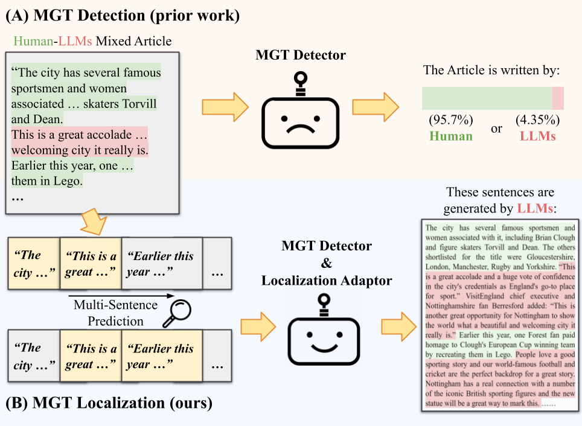
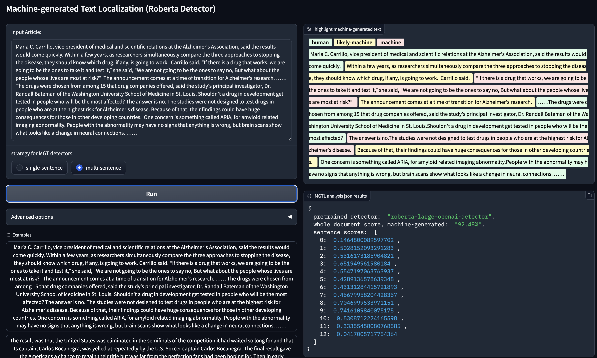
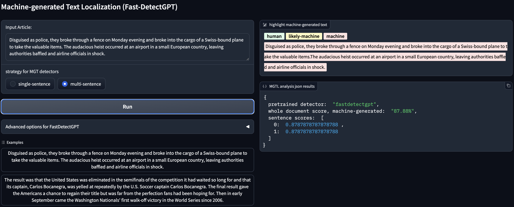
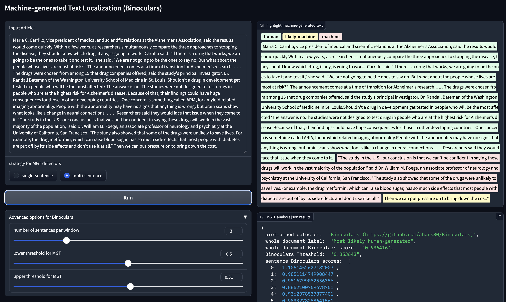

# Machine-Generated Text Localization


**Machine-Generated Text Localization** is a task aiming at recognizing machine-generated sentences within a document.
You can find our synthetic data [here](https://drive.google.com/drive/folders/18FryMm6cH5-r4YUMHXQg8gfnEpexMYPR?usp=sharing), 
Roberta+AdaLoc implmentation [here](AdaLoc/roberta_adaloc.py), 
and model weights [here](https://drive.google.com/drive/folders/1D8qYcVoYgwNG7IzadF01W3eyPiuPRnY6?usp=sharing).


If you find this code useful in your research, please consider citing our [paper](https://arxiv.org/pdf/2402.11744.pdf). 

    @InProceedings{ZhangMTL2024,
         author={Zhongping Zhang and Wenda Qin and Bryan A. Plummer},
         title={Machine-generated Text Localization},
         booktitle={Findings of the Annual Meeting of the Association for Computational Linguistics (ACL)},
         year={2024}}


<!--<div style="text-align: center;">

</div>-->


### Updates
- **`2024/03/16`** 🔥Support [Binoculars](https://github.com/ahans30/Binoculars) on MGTL, thanks a lot for their great work!
- **`2024/03/10`** 🔥Release code for Roberta+AdaLoc.
- **`2024/03/05`** Release code for data generation.
- **`2024/03/01`** Support Fast-DetectGPT[[4]](#fast_detectgpt) on MGTL. Thanks a lot for their great work!
- **`2024/03/01`** Support Roberta Detectors (OpenAI-D [[2]](#openai_d), ChatGPT-D[[3]](#chatgpt_d)) on MGTL. Thanks a lot for their great works!
- **`2024/03/01`** Gradio apps for Machine-generated Text Localization [[1]](#mgtl) (MGTL).


## Setting up the Environment
We provide two options to create an environment for MGTL. You can either create a new conda environment
```shell
conda env create -f environment.yml
conda activate mgtl
conda install pytorch==2.2.0 pytorch-cuda=12.1 -c pytorch -c nvidia
```
or set up the environment by pip
```shell
pip install -r requirements.txt
```

If spaCy is not installed before in your machine, the following command might be useful 
```shell
python -m spacy download en_core_web_sm
```

## Interactive Apps for MGTL
In this section, we provide interactive apps for the MGTL task. We have integrated OpenAI-Detector [[2]](#openai_d), 
ChatGPT-Detector [[3]](#chatgpt_d), and Fast-DetectGPT [[4]](#fast_detectgpt) into our interactive platform as examples.
Feel free to plug in your preferred/developed method!

### Support Roberta Detectors on MGTL
Apply OpenAI-Detector to MGTL
```python
python gradio_MGTL_roberta.py
```


Apply ChatGPT-Detector to MGTL
```python
python gradio_MGTL_roberta.py --model_name=Hello-SimpleAI/chatgpt-detector-roberta
```

### Support Fast-DetectGPT on MGTL
Apply Fast-DetectGPT to MGTL. We borrow the implementation code from [their official repo](https://github.com/baoguangsheng/fast-detect-gpt).
```python
python gradio_MGTL_fastdetectgpt.py
```

Though DetectGPT[[5]](#detectgpt) series methods are zero-shot methods, they still need training data to determine 
the thresholds. Otherwise, methods like Fast-DetectGPT can predict most-likely machine-generated sentences within an article, while cannot 
accurately determine whether these sentences are machine-generated. Thus, if you would like to get a decent results on 
your own data, specific data distribution files (*e.g.*, files under [gradio_utils/local_infer_ref](gradio_utils/local_infer_ref)) 
would be useful.

### Support Binoculars on MGTL 🔥
Apply Binoculars to MGTL. We borrow the implementation code from [their official repo](https://github.com/ahans30/Binoculars).
```python
python gradio_MGTL_binoculars.py
```

We found that Binoculars exhibit a strong generalization ability across various LLM-generated texts!

## Data Preparation 🔥

Since Essay and WP datasets already provide machine-generated text, we directly mix them using our *merge_sentences* 
function in [dataloader_utils.py](dataloaders/dataloader_utils.py). For GoodNews, VisualNews, and WikiText, run the 
following scripts to insert machine-generated sentences into human-written articles.    
```sh
sh scripts/prepare_manipulated_goodnews.sh
sh scripts/prepare_manipulated_visualnews.sh
sh scripts/prepare_manipulated_wikitext.sh
```
We provide the original articles of these datasets under [this folder](https://drive.google.com/drive/folders/1KmtlbHlwp2piuZIKx-HVKO3N2dRAQFjY?usp=sharing).
Manipulated articles are provided under [this folder](https://drive.google.com/drive/folders/18FryMm6cH5-r4YUMHXQg8gfnEpexMYPR?usp=sharing).

**Disclaimer: Manipulated articles should be used only for RESEARCH purpose (*e.g.*, developing MGT Detectors).**

## Train & Evaluate Roberta+AdaLoc 🔥
Run the following script to train Roberta+AdaLoc:
```sh
sh scripts/run_train_adaloc.sh
```
AdaLoc is finetuned on 10,000 GoodNews articles, we perform zero-shot experiments on VisualNews and WikiText articles.
Run the following scripts to evaluate Roberta+AdaLoc:
```sh
sh scripts/run_sentence_head_goodnews.sh
sh scripts/run_sentence_head_visualnews.sh
sh scripts/run_sentence_head_wikitext.sh
```
We provide our checkpoints and evaluation results on [Google Drive](https://drive.google.com/drive/folders/1D8qYcVoYgwNG7IzadF01W3eyPiuPRnY6?usp=sharing). Since we further filtered out some bad samples in training data, 
the evaluation results are better than we reported in our paper.


## Acknowledgement
We appreciate the following projects (and many other open source projects not listed here): 

[GPT2-Detector](https://openai-openai-detector.hf.space) &#8194;
[ChatGPT-Detector](https://github.com/Hello-SimpleAI/chatgpt-comparison-detection) &#8194; 
[DetectGPT](https://github.com/eric-mitchell/detect-gpt) &#8194; 
[FastDetectGPT](https://github.com/baoguangsheng/fast-detect-gpt) &#8194; 
[GhostBuster](https://github.com/vivek3141/ghostbuster) &#8194;
[MGTBench](https://github.com/xinleihe/MGTBench) &#8194;
[Binoculars](https://github.com/ahans30/Binoculars) &#8194;

## Reference 
<a id="mgtl">[1]</a>
Zhang, Zhongping, Wenda Qin, and Bryan A. Plummer. "Machine-generated Text Localization." arXiv 2024. 

<a id="openai_d">[2]</a>
Solaiman, Irene, et al. "Release strategies and the social impacts of language models." arXiv 2019.

<a id="chatgpt_d">[3]</a>
Guo, Biyang, et al. "How close is chatgpt to human experts? comparison corpus, evaluation, and detection." arXiv 2023.

<a id="fast_detectgpt">[4]</a>
Bao, Guangsheng, et al. "Fast-DetectGPT: Efficient Zero-Shot Detection of Machine-Generated Text via Conditional Probability Curvature." ICLR 2023.

<a id="detectgpt">[5]</a>
Mitchell, Eric, et al. "DetectGPT: Zero-Shot Machine-Generated Text Detection Using Probability Curvature" ICML 2023.

